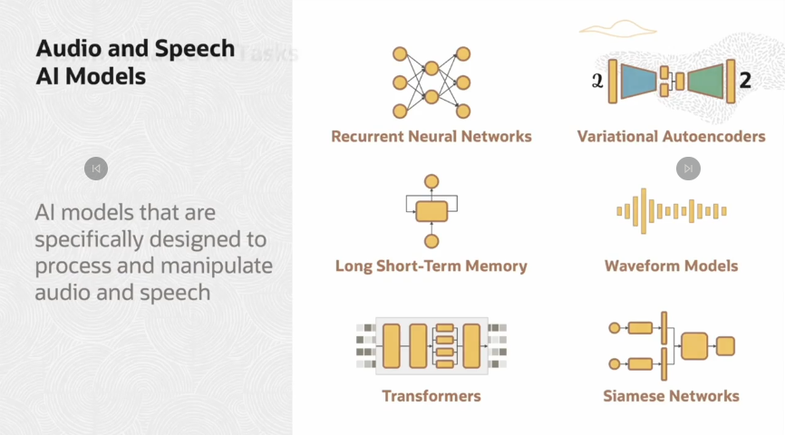

# AI Foundations
The ability of machines to mimic the cognitive abilities and problem-solving capabilities of human intelligence - AI.

If we can replicate the exact human capabilities of intelligence in machines, that is AGI. When we apply AGI to solve problems with specific, narrow objectives, we call it AI.

## Language Models
Text data is distributed in the explanation in the diagram below, showing how they work

Language AI Models are specifically designed to understand, process, and generate natural language

### Audio & Speech AI Models
They are specifically designed to proces and manipulate udio and speech.

### Vision AI Models
They are designed to process and understand visual info from images and videos

### Relationship btw AI, ML, & DL

### Neural Networks
They are made to resemble in fxn of the human brain.

## ML Foundations

`NB`: In ML _model training_ involve building a relationship between the input features and the desired output. It's the process of creating a model that can make prediction based on input data.

### Supervised Learning
Classification is a technique used to categorize or assign data points into predefined classes based on ther features or attributes.
One specific algo used in classification is `logistic Regression` - helps in predicting something is True or False instead of predicting something continuous such as the house prices.
The diagram below shows some examples of what supervised learning can be used for.

Another example of when using supervised learning for predicting house prices as shown in the figure below, here the algo minimizes the loss, through `Squared Error`:

### Unsupervised Learning
This does not involve labelling, focuses on noticeable features in data, and group similar features together - `Clustering` - grouping of similar data items, data items are more similar within a cluster than the items outside it.

Clustering can be used in Market segmentation, i.e., Input is _purchasing details_, IDing similar custmers based on _purchasing behaviour_. Now the output is _Target ADs_.
Another use case is detecting outliers, i.e., Input is _credit card purchase details_, IDing _fraudulent txns_. Output is _Anomaly Detection_.
Another example of use case is an action involving users inputs of _movie viewing history_, IDing users based on _genre of movies watched_. Output is _personalized movie recommendations_.

Here is the workflow of similarity learning workflow using unsupervised learning

### Reinforcement Learning(RL)
A type of ML that enables an agent to learn from its interactions with the environ. Recive fedback in the form of rewards or penalties, without any labeled dataset

some useful terminologies:

Here in the diagram, the policy can be likened to be the brain. And the goal of RL training loop is to find a policy that will yield a lot of reward for the agent. The optimal policy is learned thourgh training by using algos lke _Q learning_ or _Deep Q learning_

## Deep Learning
A subset of ML that focuses on training ANN with multiple layers. Allows them to automatically learn and extract intricate representations from data.

### Artificial Neural Network(ANN)
Mimics the human brain in processing data.

### Recurrent Neural Network
They process input data one elemenet at a time, maintaining a hidden state.

### Deep Learning Models

**Convolution Neural Network(CNN)**
The role of the CNN is to reduce the image into a form which is easier to process without lossing features which are critical for getting a good prediction. One of the most widely used application of CNN is _image classification_. They excel in detecting patterns, features, and objects within images.

### Generative AI
A subset of AI that creates new contents.

### LLMs
A language model is a probablistic model of text that determines the probability of a given sequence of words occurring in a sentence based on previous words. it helps predict which word is more likely to appear in the next sentence. "Large" in LLM refers to the number of parameters; no agreed upon threshold.
LLM are based on Deep Learning architecture(Transformer) - this allows them to pay selective attention to parts of input when making the next word prediction.
LLMs are deep neural networks trained on massive amount of text data consisting of large portions of the entire publicly available text on the internet.

**Transformers**
They can look at all the words in a sentence and understand the relationship between all the words in a sentence at the same time. There is something also referred to as _Attention Mechanism_ which adds context to a the Text. That is they weigh the importance of different words or tokens relative to each other, this mechanism enables the model to capture long dependencies & contextual relationships within the input data & enhancing its ability to understand the context

**Tokens**

**Embeddings**

The box refers to the encoder model, while the numerical representations(embedding) and be called vectors

Below is how Retrieval Augumented Generation is achieved

_Decoder -Model_ - take a sequence of words and output next word. Primarily used in text generation, chat-style models, etc.,

in the above diagram there are self referential loops to the decoder - after the decoder generates a token it sends it bck to the decoder along with the next input sequence to generate the next token

### Prompt Engineering
_Prompt_ - the input or initial text provided to the model

_Pomt Engineering_ - the process of iteratively refininig a prompt for the purpose of eliciting a particular style of response.

**LLM Fine tunning & Inference**
__Fine-tuning__ - LLM is fine-tuned by taking a pretrained foundational model and providing additional training using custom data. Fine-tuning of Large Language Models (LLMs) is primarily performed to adapt the model to specific tasks or domains. If your application doesn't require task-specific adaptation, then fine-tuning may not be necessary. Fine-tuning can be used to optimize the efficiency and resource utilization of LLMs, help adapt the model to domain-specific vocabulary, and address bias-related issues.

__Inference__ - model receives new text as input and generates output text based on what it has learned during pretraining and fine-tuning.

__In-context Learning__ - In-context learning refers to the capability of generative large language models (LLMs) to learn and perform new tasks without further training or fine-tuning. Instead of modifying the model permanently, users can guide the model's behavior by providing a few examples of the target task through the input prompt. This is particularly useful when direct access to the model is limited, such as when using it through an API or user interface.

### OCI Gen AI Service
Notes were not taken simply because, these services change over time. Preferably you go through the course material as they are updated from time to time.