# Oracle Cloud Infrastructure Architect Associate
## Identity Domains
A self-contained IAM service. Act as a container to manage user, roles, federation, SSO, MFA e.t.c.

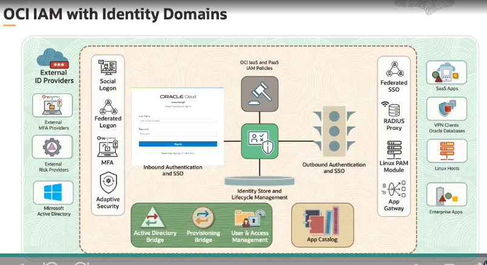

Why do we need multiple ID domains?
Isolation of administrative control, security & compliance and simplified management.
Another advantage of creating another ID domain is that a default user is created to manage that domain. Note that when you create an ID check the default region. Additional domain are not by default replicated to other regions by default, so make sure that you do the replication.

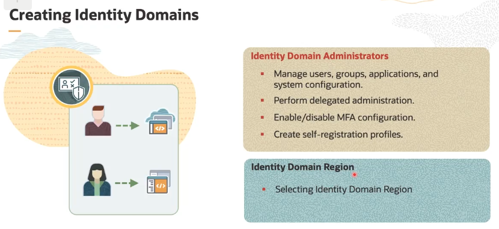

some of the default groups are shown in the figure below:

## Policies
follow the principles of least privilege when assigning roles.

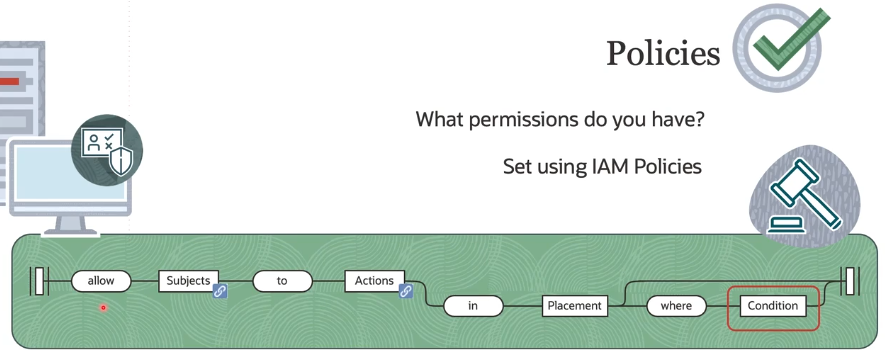

Different methods of creating policies, they are listed below:

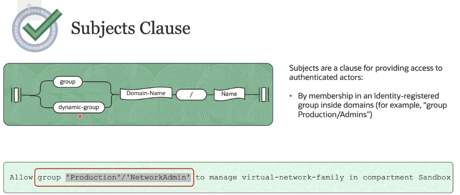

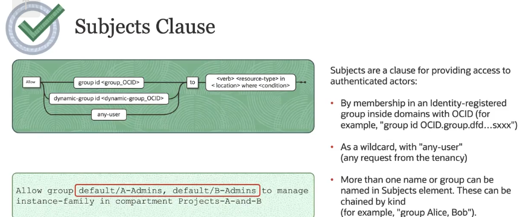

some precautions that should be taken:
when you do not prefix a domain that should be used when creating a policy the default domain is used, so care must be taken to indicate that.

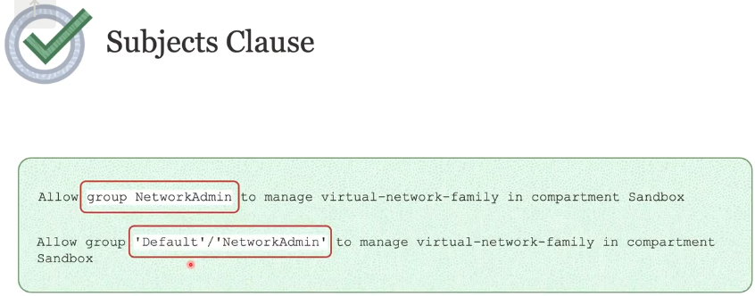

Another clause that shoudl be noted is the ___Action Clause___ - typically used with APIs. notable verbs includes; _inspect, read, use, manage_.

The diagram below shows the actions, now actions in OCI are resouces. When setting policies you can choose to make it Aggregate or Individual (granular or specific) type of resource

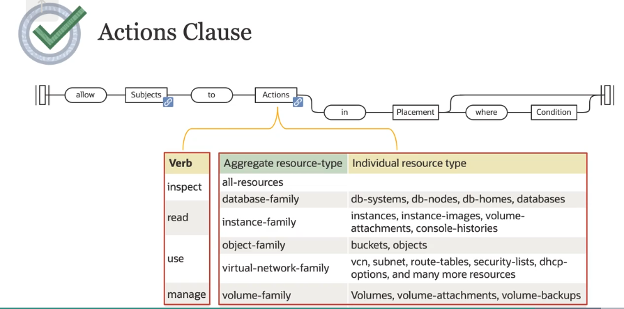

now for the labeled __placement__ in the diagram, it determines the scope of the policy and where the action is allowed. i.e., to specify a tenancy, either a compartment name or compartment id

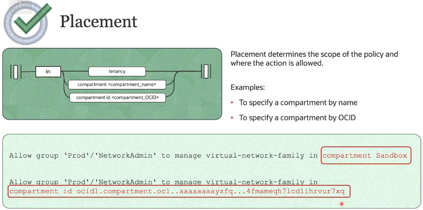

## Compartments
every resource must belong to a specific compartment. Resource can interract with resources in other compartments.

## Permissions
Permissions are atomic units of AuthZ that control a user's ability to perform operations on resources.

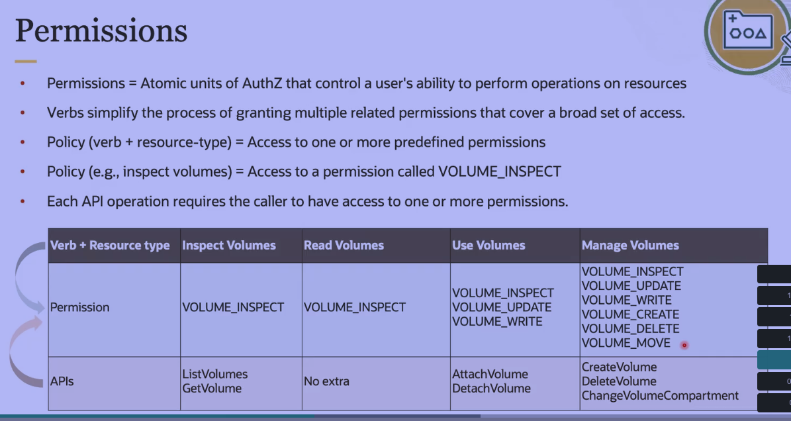

## Removing Less-Permissive Policies
It is very important to remove redundant policies which would lead to slowing resources down.
Excessive policies has its downsides in that it can lead to security holes.
In OCI when multiple policies are in scope, the policies that grants maximum permission takes precedence regardless of where it is attached in the compartment hierarchy

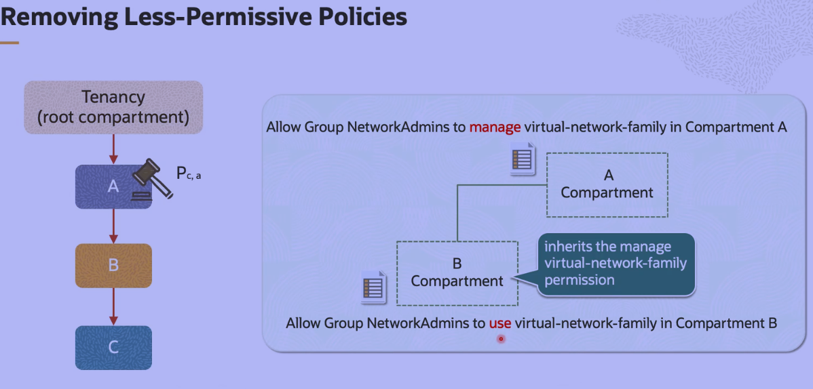

## Route Table
Consists of a set of route rules, each rule specifies the:
> Destination CIDR block
> Route target (the next hop) for traffic that matches the CIDR

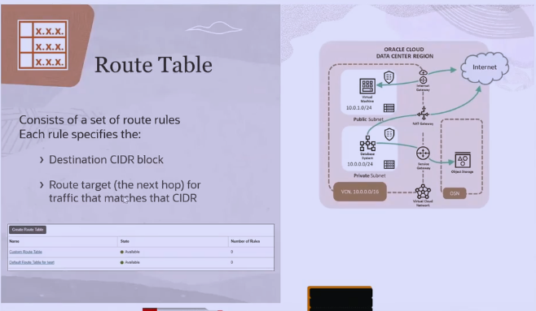

## Service Gateway

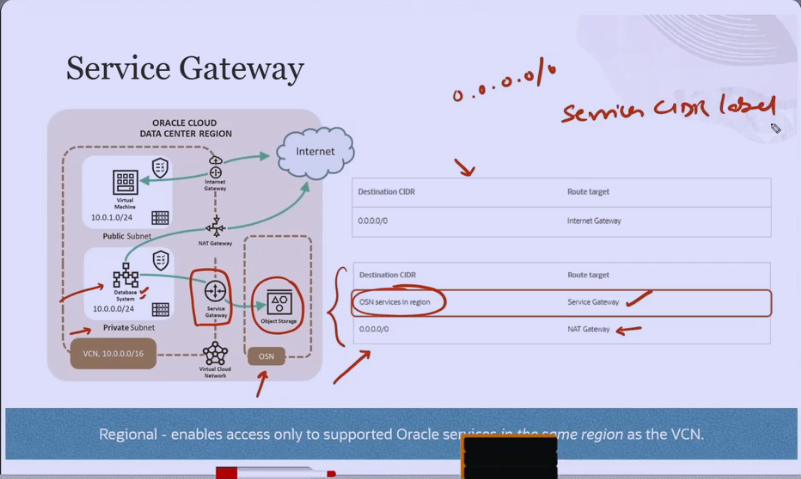

Service CIDR label is a much easier way of assigning a destination CIDR in a routing table.

## VCN Security
Note that there are two ways that a private IP can communicate with resources outside the VCN, one is the _bastion_, & _DRG_

## NSG
Are firewall rules that allows or deny ingress or egress traffic. Usually assigned to the VNIC of VMs, can be stateful - meaning allows tracking of responses during network connectivity.