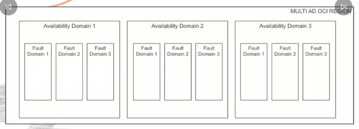
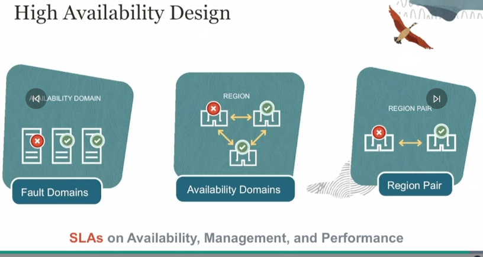

# OCI

## Architecture
Regions - Availability domains (AD)
AD - consists of Fault domains (FDs). They are isolated from each other, fault tolerant, unlikely to fail simultaneously, physical infra is not shared.

Now the FDs are logical data centers within an AD, it should be noted that each AD consists of 3 FDs 

here is a diagram of how to avoid single point of failure

## IAM

In compartments, this is strictly followed not enable authZ - to ensure proper access control to resources. Resources in compartments can be moved around.

It should be noted here that the OCID is used to uniquely ID a resource.

### Tenancy
It is a best practice to not use the tenancy Admin account for day-to-day Ops.
Instead you create dedicated compartments to isolate resources. Remember to enforce MFA

## Networking
some terminologies to note are:
Internet Gateway
NAT Gateway
Service Gateway
Dynamic routing Gateway

### Peering

In a situation where there are multiple networks and there is a need for communications, below are 2 of these categories.

However if there are lets say 3-300 VCNs, DRG v2 are employed to scale these networks

### Load Balancer
There are 2, The HTTP LB(Layer 7).and Network LB(Layer 3,4). Http LB can exist in 2 forms, web and private. While the Network LB are used primarily for perf reseasons. Go for HTTP LB if you want more intelligence in inspecting packets.

### Serverless

FaaS - The idea is that of decreasing concern and control over infra implementation.

## Security

### Cloud Guard
Cloud Guard performs different functions which are depicted in the diagram below:

remember Target -> detection -> problem -> responder (TDPR)

### Security Zones
The idea here is that some elements in your tenancy are super secure, hence assigning them to a security zone, violation of these policies would mean `operation denied`

### Security Advisor
This is the combination of the Cloud G, Sec Zone, & other security services fxnalities

### Vault
A service that you can use to centrally manage your keys, secrets, certs. Which involves the creation and managing access.
Some key takeaways from the topic of `Security` is that Sec Zones ensure adherence to security best practices and policies and help maintain strong security posture by preventing the creation of non-compliant resources.

Cloud Guard has three main components – detectors, problems, and responders. Detectors continuously monitor your infrastructure, looking for potential issues. Problems are the security risks and issues that detectors identify. Responders are the automatic or manual actions taken to address the identified problems. Targets are not a component of Oracle Cloud Guard

A vault in OCI is a logical entity where you can centrally manage and store your encryption keys and secrets. A secret is a resource that helps manage credentials needed to access OCI resources. A master encryption key is a key that OCI uses to encrypt the encryption keys that you create in the vault (these are customer managed). Database backup is not a component of OCI Vault; it is a functionality associated with the OCI Database service.

In the OCI shared security responsibility model, Oracle is responsible for securing the underlying cloud infrastructure. This includes securing the physical data centers, network infrastructure, and hardware that support the cloud services, ensuring a secure and reliable environment for customers to deploy their applications and store data.

## Governance and Administration

Service limits are the upper bounds placed by Oracle on the number of resources you can create in a region or tenancy, whil compartment quotas are the upper bounds defined by the users for resource usage within specific compartments. The distinction is that service limits are set by Oracle and pply to a tenancy in a region, while compartment quotas are set by the user and apply to specific compartments.

In OCI, you can set up email alerts to receive notifications when budget thresholds are reached. These alerts help customers stay informed about their spending and take appropriate actions to manage their costs.

The supported pricing models in OCI include Pay As You Go, Oracle Universal Credits, and Bring Your Own License (BYOL).

It should be noted that th primary factors that influence pricing in OCI includes data transfer costs, the specific service consumed, and the specific services consumed, and the specific typ of resource utilized. In OCI, Ingress data transfer is typically free. However, egress data transfer(data going out from OCI to the internet) is chargeable after the first 10TB/month, depending on the specific region and destination.

