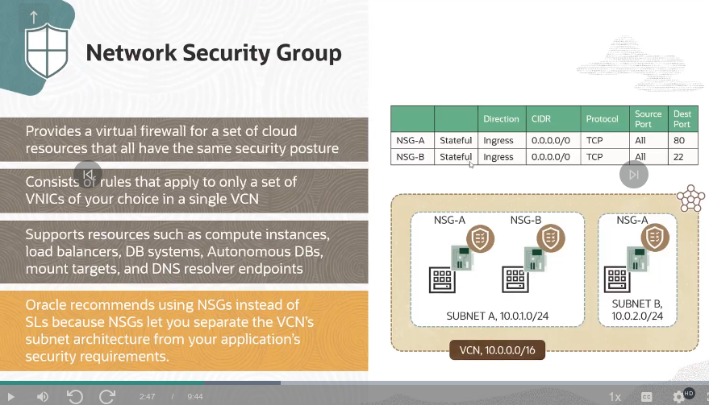

# VCN
A vcn IP should not overlap with another vcn.

## Subnet
A vcn is divided into subnets. Each subnets has a contiguous range of IPs described in CIDR notation. Subnet IP ranges cannot overlap. IPV6 is optional. A Subnet can grow or shrink after creation. Each subnet can be: `AD-specific`: containted in a single AD in a multi-AD region, can be `Regional(recommended)`: spans all 3 ADs in a multi-AD region.
VNICs determines how the instance connects with endpoints inside and outside the VCN.

## VNICs
Has an optional host name for DNS for each private IP addr. Also has a MAC addr. A flag to enable or disable the src/dst check on the VNIC's network traffic. NSG hv __security rules__ that apply on that apply only to the VNICs in that NSG. VNICs also have OCIDly to the VNICs in that NSG. VNICs also have OCID.
Every VNIC is assigned a primary private IP addr when it is created, which is configured automatically on the corresponding Ethernet device in the instance OS.
Every VNIC can have additional private IPs called secondary private IP(max 31).
A VNIC resides in a subnet and enables a compute instance to be connected to a VCN via route tables, and security rules determine connectivity of aht compute instance.

### Private IP
Each instance has at least one primary private IP.
When a public subnet is used, a private IP can have an __optional__ public IP assigned to it.
Every VNIC has one primary IP and can have additional priv IPs called secondary private IPs.

### Public IP
You can assign a given resrouce multiple public IPs across one or more VNICs.
They can be ephemeral or reserved.
When you launch an instance in a public subnet, by default, the instance gets a public IP unless you say otherwise.
After you create a given pulic IP, You cannot change its type. That is if you launch an instance that is assigned an ephemeral public IP with addr,lets say 1.11.1.1, you cannot convert the ephemeral public IP to a reservfeed public IP with addr 1.11.1.1.

 There are also the concept of BYOIP, which has some strict rules that must be followed.

__IP Pools__
What baffles me here is how OCI manages this...would they run out of ip addresses if customers are reserving large amounts of IPs.

## Security Lists
Stateful Security Rules

Stateless Security Rules

On a final note, some protocols, like ICMP, require an egress rule regardless of the state option. 

## NSGs

## OCI Gateway

### Internet Gateway

IG provides a path for network traffic btw your VCN & the internet. Your can hv onl one IG per VCN. After creating an IG, you must add a route for the gateway in the public subnet route table to enable traffic flow. the IG allows inbound traffic to the pucli subnet. Instances need a public IP addr assigned.

### NAT Gateway
Host can initiate outbound connections to the internet and recieve responses, but no receive inbound connections initiated from the internet. Uses case: Updates, patches.
Something that is distinct in the OCI is once your setup a NAT gateway you don't need to setup an IG for you to use the NAT Gateway

Below is a figure showing the limits and boundaris for the NAT gateway.

### Dynamic Routing Gateway(DRG)
some of the main features of DRG incs:

however DRG has its special use cases:

here are some DRG attachments

### Remote Peering Connection(RPC)

### Service Gateway

### Private Endpoints

Below is Private endpoints in Object Storage

### Public IPs
You can assign a public IP to an instance to enable communication with the internet.The instance is assigned a public IP from the OCI addr pool.
here are some things that must be put in place for the instance to comm directly with the internet:

Public IPs come in two categories:

__Ip address insight__- a cool tool in OCI i think you should checkout.

### Notes on LB
There are actually 2 categories:
http and Network LBs.
For the HTTP LBs, there is the _content-based routing: host based_ - involves multiple websites using a single LB & a independent set of back-end servers.

There is another known as the path-based still under the content-based routing:

There are two types of LBs:

__Load Balancing Policies__ 
A note on this use case:

You are tasked with configuring a Network Load Balancer (NLB) in Oracle Cloud Infrastructure (OCI) to distribute traffic among a group of backend servers. Your backend servers are hosting a critical application that requires session persistence based on both source and destination IP addresses, source and destination ports, and protocol. Which NLB configuration option should you select to meet this requirement?

_Answer_: 5-Tuple Hash: Routes incoming traffic based on 5-Tuple (source IP and port, destination IP and port, protocol) Hash. This is the default Network Load Balancer policy.

## DNS Management
_read up on this_

## Traffic Steering
Traffic mgt enables customers to config routing policies for serving intelligent responses to DNS queries.
Different answers can be served for a query according to the logic in the customer-defined Traffic management Steering Policy, thus sending users to the most optimal location in your infra.
__Use cases__:

Example: You are responsible for optimizing traffic flow in your Oracle Cloud Infrastructure (OCI) environment and want to implement Traffic Management Steering Policies to direct users to the nearest available instance. Which steering policy in Oracle Cloud Infrastructure Traffic Management should you choose for this purpose?

_Answer_: Geolocation Steering policies distribute DNS traffic to different endpoints based on the location of the end user.

__Traffic Mgt Concepts__:

_checkout Geolocation traffic steering lab_

# Design for Hybrid Networking Architecture

## BGP

### Equal-Cost Multi-Path Routing(ECMP)

ECMP enables flow-based load balancing of network traffic over multiple virtual circuits or multiple IPsec tunnels (not a mix) using BGP.
It allows active-active LBing and failover of network traffic btw a maximum of 8 circuits.
5-tuple is used to distinguish flow. Multiple flows will be necessary to utilize all available bandwidth.

An overview of an architecture for ECMP

### Site-to-Site VPN
offers a simple & secure way to connect your corporate network to OCI over your existing internet connection. It is recommended to always use BGP for all your tunnels, or static routing for all your tunnels

This are some of the use cases:

Another method of connecting on-premise to OCI is through the following topic below 

### FastConnect
From the image below we would be focused on FastConnect

below are FastConnect connectivity models

And then 